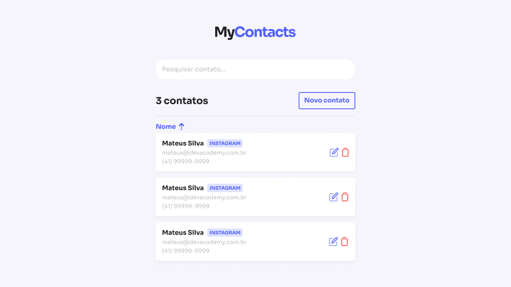

<p align="center">
  
</p>

<br />

## Tópicos

<div>
 • <a href="#-sobre-o-MyContacts">Sobre o MyContacts</a> </br>
 • <a href="#-tecnologias">Tecnologias</a> </br>
 • <a href="#-layout">Layout</a> </br>
 • <a href="#-funcionalidades">Funcionalidades</a> </br>
 • <a href="#-como-executar-o-projeto">Como executar</a> </br>
 • <a href="#-como-contribuir">Como contribuir</a> </br>
 • <a href="#-autor">Autor</a> </br>
 • <a href="#user-content--licença">Licença</a></br>
</div>

<br />

## 📱 Sobre

**My**Contacts é um software de gerenciamento de toda sua a lista de contatos!

Nele, o usuário vai conseguir acrescentar novos contatos, editar contatos existentes e excluir os contatos que não fazem mais parte da sua lista de contatos.

O projeto foi desenvolvido inteiramente pelo [Mateus Silva](https://www.linkedin.com/in/mateusilva/) com JavaScript e com a utilizando da lib PropTypes. Para ter um desafio a mais, decidi construir o projeto em paralelo utilizando TypeScript.

Este projeto faz parte do Stage One do curso [JStack](https://jstack.com.br/) e o desenvolvimento vai ser realizado conforme as aulas do curso.

<br />

## 🚀 Tecnologias

Tecnologias e ferramentas utilizadas no desenvolvimento do projeto:

#### **Website** ( [ReactJS](https://reactjs.org/) + [TypeScript](https://www.typescriptlang.org/) )

-  [StyledComponents](https://styled-components.com/)
-  [React Router Dom](https://reactrouter.com/en/main)

#### **API** ( [NodeJS](https://nodejs.org/en/) + [TypeScript](https://www.typescriptlang.org/) )

-  [Express](https://expressjs.com/pt-br/)

#### **Utilitários**

-  Protótipo: **[Figma](https://www.figma.com/)** → **[Protótipo (MyContacts)](https://www.figma.com/file/ImPnxNEktRKLcNxylyBtU0/MyContacts)**
-  Editor: **[Visual Studio Code](https://code.visualstudio.com/)** → Extensions: **[Prettier](https://prettier.io/)** + **[EditorConfig](https://editorconfig.org/)**
-  Fontes: **[General Sans](https://fonts.google.com/specimen/Sora)**
-  Versionamento: **[Git](https://git-scm.com)**
-  Padronização de código: **[ESLint](https://eslint.org/)**

<br />

## 🎨 Layout

Os layouts do app estão disponíveis no **Figma**: https://www.figma.com/file/ImPnxNEktRKLcNxylyBtU0/MyContacts

<p align="center">
  
</p>

<br />

## ⚙️ Funcionalidades

O projeto simula uma lista de contatos e armazena os dados no banco de dados de acordo com as ações definidas pelo o usuário. Construímos 3 rotas na aplicação, uma rota Home que vai ser responsável por carregar os dados desse banco de dados e apresentar todos os contatos que o usuário já possui cadastrado, tal como realizar modifições ou excluir um determinado contato.

A rota para adicionar um novo contato vai fazer a conexão entre a nossa aplicação e o banco de dados onde esta armazenado as informações do contato, e adicionar um novo contato através de um formulário preenchido pelo usuário.

E a última rota é para realizar modificões em um contato já existe, através de um formulário parecido com o formulário que visualizamos na roda para adicionar um novo contato.

<br />

## 🚀 Como executar o projeto

Este projeto é divido em duas partes:

1. Backend (pasta api)
2. Frontend Web (pasta client)

💡 O Frontend precisa que o Backend esteja sendo executado para funcionar.

### Pré-requisitos

Antes de começar, você vai precisar ter instalado em sua máquina as seguintes ferramentas: <br />
→ [Git](https://git-scm.com);<br />
→ [Node.js](https://nodejs.org/en/);<br />

Além disto é bom ter um editor para trabalhar com o código como [VSCode](https://code.visualstudio.com/);

#### 🎲 Rodando a aplicação (Backend)

```bash
# Clone este repositório
$ git clone https://github.com/vitorrsousaa/MyContacts.git
# Vá para a pasta da aplicação Front End
$ cd api
# Instale as dependências
yarn install
# Rode a aplicação
yarn start
# A aplicação será aberta na porta:3001 - acesse http://localhost:3001
```

---

#### 🧭 Rodando a aplicação web (Frontend)

```bash
# Clone este repositório
$ git clone https://github.com/vitorrsousaa/MyContacts.git
# Vá para a pasta da aplicação Front End
$ cd client
# Instale as dependências
yarn install
# Rode a aplicação
yarn start
# A aplicação será aberta na porta:5173 - acesse http://localhost:5173
```

---

<br />
# 📮 Entre em contato

**Linkedin**: https://www.linkedin.com/in/vitorr-sousaa/

Desenvolvido por **Vitor Sousa** 👋🏻🧑
